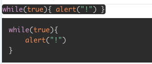

See [prismjs](https://prismjs.com/).

[Supported languages](https://prismjs.com/#supported-languages)

```tsx
import { Code, CodeInline } from "@hrdtbs/react-code"

export default () => (
    <>
        <CodeInline>{`
        while(true){
            alert("!")
        }
        `}</CodeInline>
        <Code>{`
        while(true){
            alert("!")
        }
        `}</Code>
    </>
)
```


